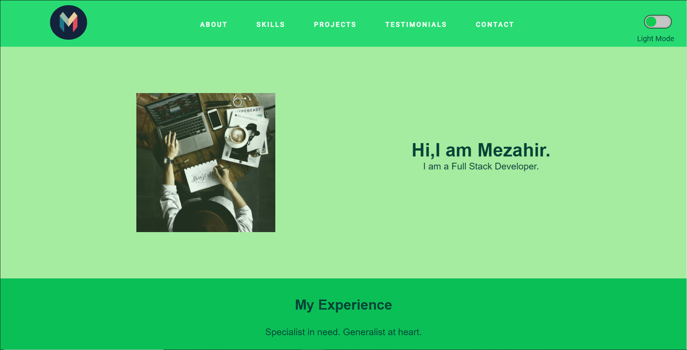

# My Portfolio
> It's my portfolio.

## Table of contents
* [General info](#general-info)
* [Screenshots](#screenshots)
* [Technologies](#technologies)
* [Status](#status)

## Screenshots

## Technologies
* HTML5
* CSS3
* Javascript

## Status
Project is: _finished_
